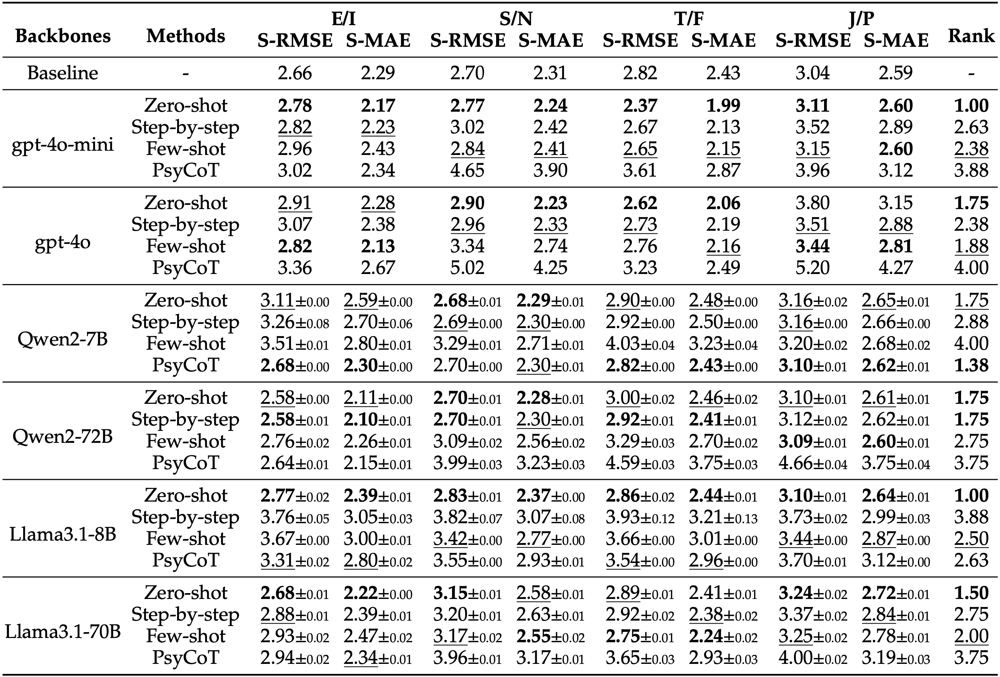

<div align="center">

# <span style="font-variant:small-caps;">MbtiBench</span>

[](https://arxiv.org/abs/2412.12510)
<!-- [](TODO) &nbsp;&nbsp; [](https://arxiv.org/abs/2412.12510) -->

</div>

Code for *Can Large Language Models Understand You Better? An MBTI Personality Detection Dataset Aligned with Population Traits*

## 💡 Introduction

The <span style="font-variant:small-caps;">MbtiBench</span> Personality Detection Dataset is a pioneering resource designed to address the challenges in personality detection from written content, particularly focusing on the Myers-Briggs Type Indicator (MBTI). Unlike existing datasets that rely heavily on self-reported MBTI labels from social media posts, our dataset is carefully curated to align with population-wide personality traits. By incorporating expert-guided annotation and advanced filtering techniques, this dataset offers a more accurate reflection of how personality traits manifest in real-world text.

The dataset introduces a novel approach to personality detection through the use of *soft labels*, which estimate personality polarity tendencies rather than relying solely on binary MBTI categories. This method captures the nuanced, non-extreme traits that are common in most individuals, providing a more comprehensive view of personality in natural language.

Key Features:
- Expert-annotated MBTI dataset, aligned with the true distribution of population traits.
- Introduction of *soft labels* to capture the full range of personality traits, moving beyond the limitations of binary MBTI classifications.
- Extensive benchmarking with six large language models (LLMs) and four prompting methods.
- Detailed analysis of LLM predictions, emphasizing biases and polarized predictions as key areas for future research.
- Open for both academic and commercial research, with no restrictions on use, provided it complies with the ethical guidelines.

This dataset is a significant step forward in the field of personality detection, offering researchers and developers a high-quality, annotated resource to advance their work.

## 📚 Dataset

The <span style="font-variant:small-caps;">MbtiBench</span> contains 286 samples. The dataset is located in [`dataset/mbtibench.jsonl`](dataset/mbtibench.jsonl), with each sample in JSON format. A sample is shown below:
```json
{
  "id": 1,
  "source": "kaggle",
  "annotation": {
    "E/I": {
      "A1": "I-",
      "A2": "I-",
      "A3": "I-"
    },
    "S/N": {
      "A1": "S-",
      "A2": "S+",
      "A3": "S-"
    },
    "T/F": {
      "A1": "T-",
      "A2": "T+",
      "A3": "T-"
    },
    "J/P": {
      "A1": "P-",
      "A2": "J-",
      "A3": "J-"
    }
  },
  "posts": [
    "think that all these situations depend on who they are and how much you have in common. As years go by I find that life's experiences are a good way to let people know you and interact. ",
    "I took the last coment a little strongly , and I apologize for the level of my response. Since I am not 13 I find your retort, well childish.  Duty means always fulfilling; epinephrine Stuck on you- lionel Ritchie How could she thank you when 's will clearly be the winner. I will fullfill my duty in this battle for 's I work with somone who is incompetant( slow, lazy, and  lacking in brain power). I find myself doing most of his work as well as mine. I am blessed however to get the respect from my bosses I deserve ",
    "Well since my enneagram is The Loyal Friend I would say that I am that kind of friend. garden I tend to interested in things I like,but I am up to trying new things. As far as fashion I wear what I like not what is deemed acceptable. When I am tired I am less likely to want to do something ",
    "I would have to say , because I am married to one who makes my life great!:proud: I also go to music as a relief from trouble, but it always helps me. I especially like to listen to K-LOVE in these times. :happy: I would have to say music is and will be a big part of my life. I like most all kinds classical, rock, alternative, reggae, pop, jazz, blues. I have been to many concerts and enjoyed them all. I have "
  ],
  "softlabels": {
    "E/I": 0.8067729083665338,
    "S/N": 0.11072664359861584,
    "T/F": 0.13307984790874527,
    "J/P": 0.48282442748091603
  },
  "hardlabels": {
    "E/I": "I",
    "S/N": "S",
    "T/F": "T",
    "J/P": "J"
  }
}
```

Description of corresponding fields:
- `id`: Sample ID
- `source`: Data source of the sample. Possible values are "kaggle", "pandora", "twitter".
- `annotation`: Annotations made by three labelers (A1, A2, A3) on the four personality dimensions for this sample. Each dimension has four possible values, e.g., the E/I dimension may take values like "E+", "E-", "I-", "I+".
- `posts`: The social media posts of the user.
- `softlabels`: Soft labels for the four personality dimensions in this sample. The value range is $[0, 1]$.
- `hardlabels`: Hard labels for the four personality dimensions in this sample. Each dimension has two possible values, e.g., the E/I dimension may take the values "E" or "I.


<details>
<summary>

### Soft Label Reproduction

</summary>

The soft label values in [mbtibench.jsonl](dataset/mbtibench.jsonl) are automatically generated based on the labelers' annotations using the EM algorithm. If you wish to reproduce these soft label values, you can generate them using the [original dataset](dataset/mbtibench-nolabel.jsonl) by running the algorithm script as follows:
```shell
$ python dataset/em_softlabel.py
```

</details>

## 🏗️ Evaluation

### ⚙️ Environment Setup

To run this project, Python 3.10 is required. Install dependencies using `requirements.txt`:
```shell
$ pip install -r requirements.txt
```

### 🌡️ Soft Label Inference

First, launch the OpenAI Compatible Server for model inference. If you wish to use closed-source models such as GPT-4o, you may skip this step:
```shell
$ python -m vllm.entrypoints.openai.api_server \
      --model /path/to/Meta-Llama-3.1-70B-Instruct \
      --served-model-name llama3.1-70b \
      --trust-remote-code \
      --tensor-parallel-size 4 \
      --max-model-len 32768 \
      --port <VLLM_SERVER_PORT>
```
For SLURM users, we provide a script to submit jobs. You can use `sbatch scripts/server.sh` to submit the task.

> If you wish to evaluate OpenAI's online models, please create a `.env` file and enter the API Base URL and your API key. A sample is provided in `.env.example`.

Below is an example command for evaluating personality detection using the Zero-shot method with Llama-3.1-70B:
```shell
$ python inference.py --method zero-shot --type soft --model llama3.1-70b --host <VLLM_SERVER_IP> --port <VLLM_SERVER_PORT> --round 0
```

> If you wish to perform hard label evaluation, simply use `--type hard` instead of `--type soft.py`.

To facilitate batch evaluation, we provide `scripts/launcher.sh`. You can submit batch evaluation tasks by running `bash scripts/launcher.sh`.

### 📈 Result Summarization

Below is an example command for calculating metrics for personality detection:
```shell
$ python evaluate.py --model llama3.1-70b --method zero-shot --type soft
```

To facilitate batch metric calculations, we provide a script to get results. You can run `bash scripts/eval.sh` to compute scores in batch.

## 📊 Results

We evaluate the GPT-4o series, Qwen2 series, and Llama3.1 series on <span style="font-variant:small-caps;">MbtiBench</span> using four prompt templates: Zero-shot, Step-by-step, Few-shot, and PsyCoT. The LLMs are tasked with predicting the soft labels for the four personality dimensions, and the results are shown in the table below.



> For the Qwen2 and Llama3.1 series, we repeat the experiments 5 times and displayed the average and standard deviation of the 5 runs in the table. For the GPT-4o series, we conducte only one experiment.

We use S-RMSE (Segmented Root Mean Square Error) and S-MAE (Segmented Mean Absolute Error) as evaluation metrics for soft labels, with the formulas as follows:
```math
\begin{align*}
  \text{S-RMSE} &= \sqrt{\frac{1}{n} \sum_{i=1}^n (bin(y_i) - bin(\hat{y}_i))^2} \\
  \text{S-MAE} &= \frac{1}{n} \sum_{i=1}^{n} |bin(y_i) - bin(\hat{y}_i)|
\end{align*}
```

You can find more detailed information in our paper.

> [!NOTE]
> Our experiment logs can be found [here](./results-reproduce) for reproducing the results shown in the table.

<details>
<summary>

## Soft Label Effectiveness Validation

</summary>

We use the stress detection dataset Dreaddit to validate the effectiveness of soft labels. Each entry in Dreaddit is a post from a poster, and the task requires the LLM to determine whether the poster is under stress based on their post. We aim to leverage the personality information extracted from the post to help the LLM perform better in the stress detection task.

The process is divided into two steps:

**Step 1**: Identify the personality information of the poster based on the post:

```shell
$ export PYTHONPATH=$(pwd)
$ python downstream/inference-mbti.py --method zero-shot --type soft --model gpt-4o --round 0
```

> If you wish to perform hard label evaluation, simply use `--type hard` instead of `--type soft.py`.

To facilitate batch inference, we provide `scripts/downstream-mbti-launcher.sh`. You can submit batch inference tasks by running `bash scripts/downstream-mbti-launcher.sh`.

**Step 2**: Use the personality information to help the LLM perform the stress detection task:

```shell
$ export PYTHONPATH=$(pwd)
$ python downstream/inference-task.py --method zero-shot --type soft --model llama3.1-70b --host <VLLM_SERVER_IP> --port <VLLM_SERVER_PORT> --mbti_model gpt-4o --round 1
```

> If you wish to perform hard label evaluation, simply use `--type hard` instead of `--type soft.py`.

To facilitate batch inference, we provide `scripts/downstream-task-launcher.sh`. You can submit batch inference tasks by running `bash scripts/downstream-task-launcher.sh`.

To obtain performance metrics for the LLM in the stress detection task, you need to register the personality label type, the model used for personality detection, and the model used for the stress detection task in the `downstream/evaluate.py` file. Here's an example:

```python
configs = [
    {"type": None, "task_model": "llama3.1-70b", "mbti_model": None},
    {"type": "hard", "task_model": "llama3.1-70b", "mbti_model": "gpt-4o"},
    {"type": "soft", "task_model": "llama3.1-70b", "mbti_model": "gpt-4o"},
]
```

Then, you can run this file to obtain the LLM's performance in the stress detection task:

```shell
$ export PYTHONPATH=$(pwd)
$ python downstream/evaluate.py
```

</details>

## 📝 Citation

```latex
@inproceedings{Li2024CanLL, 
  title={Can Large Language Models Understand You Better? An MBTI Personality Detection Dataset Aligned with Population Traits}, 
  author={Bohan Li and Jiannan Guan and Longxu Dou and Yunlong Feng and Dingzirui Wang and Yang Xu and Enbo Wang and Qiguang Chen and Bichen Wang and Xiao Xu and Yimeng Zhang and Libo Qin and Yanyan Zhao and Qingfu Zhu and Wanxiang Che}, 
  year={2024}, 
  url={https://api.semanticscholar.org/CorpusID:274788748} 
}
```
